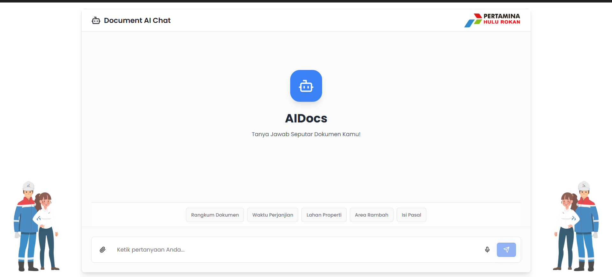

# DocumentAI - AI-Powered Document Q&A System

DocumentAI is an advanced system that leverages AI to analyze and answer questions about PDF documents using hybrid retrieval technology (BM25 + FAISS semantic search).



## Features

### Frontend

- **Modern Chat Interface**: Responsive and user-friendly.
- **File Upload**: Drag & drop PDF files.
- **Voice Input**: Ask questions using voice.
- **Quick Questions**: Predefined question templates.
- **Responsive Design**: Optimized for desktop and mobile.

### Backend

- **AI-Powered Q&A**: Powered by DeepSeek Chat V3.
- **Hybrid Retrieval**: Combines BM25 and FAISS semantic search.
- **RESTful API**: Well-documented endpoints.
- **File Management**: Upload, list, and delete PDF files.


### Manual Setup

#### Backend

1. Create and activate a virtual environment:
   ```bash
   python -m venv venv
   venv\Scripts\activate  # Windows
   source venv/bin/activate  # Linux/Mac
   ```
2. Install dependencies:
   ```bash
   pip install -r requirements.txt
   python -m spacy download en_core_web_sm
   ```
3. Start the server:
   ```bash
   python main.py
   ```

#### Frontend

1. Install dependencies:
   ```bash
   npm install
   ```
2. Start the development server:
   ```bash
   npm run dev
   ```

## Usage

### Preparing Documents

1. Extract text from PDFs:
   ```bash
   python extract_text.py
   ```
2. Chunk documents:
   ```bash
   python semantic_chunker.py
   ```
3. Build FAISS index:
   ```bash
   python build_index.py
   ```

### Asking Questions

Use the API or frontend interface to ask questions like:

- "Summarize document Akarsana Fujiati"
- "What is the agreement date for document Balijan Nugroho?"


### Process Visualization


## API Endpoints

### Health Check

```http
GET /health
```

### Ask Question

```http
POST /ask
Content-Type: application/json

{
  "question": "Summarize document Akarsana Fujiati",
  "top_k": 5
}
```

### Upload File

```http
POST /upload
Content-Type: multipart/form-data

file: <PDF file>
```

### List Files

```http
GET /files
```

### Delete File

```http
DELETE /files/{filename}
```

## Configuration

### Backend (.env)

```env
OPENAI_API_KEY=your-api-key
HOST=0.0.0.0
PORT=8000
DEBUG=True
```

### Frontend

Edit `src/lib/api.ts`:

```typescript
const API_BASE_URL = "http://localhost:8000";
```

---

**Happy Document Analyzing!**
